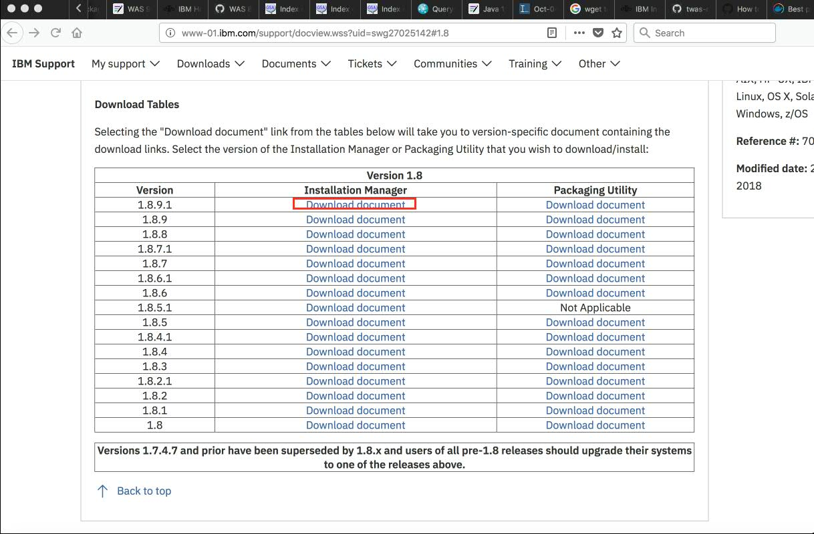
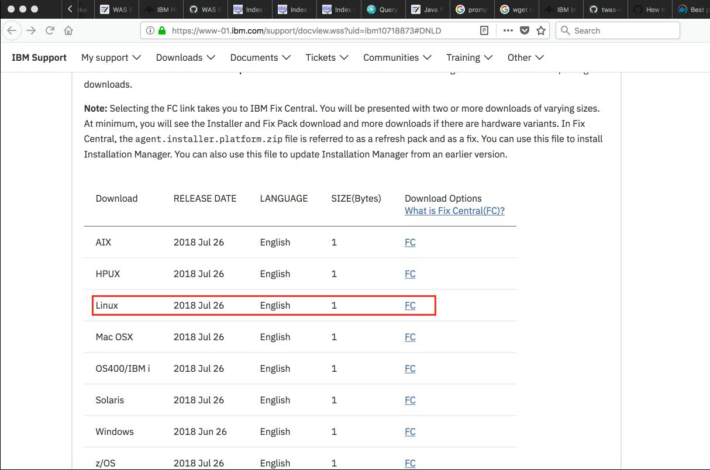
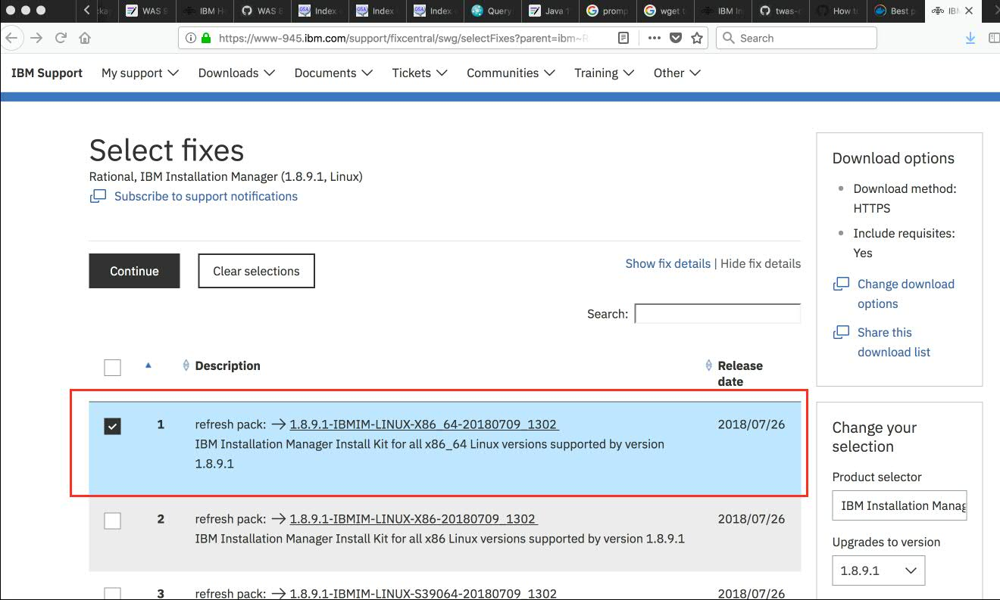

## How to get the IBM Installation Manager install kit url

1. Select the lastest version of Installation Manager to download from [http://www-01.ibm.com/support/docview.wss?uid=swg27025142](http://www-01.ibm.com/support/docview.wss?uid=swg27025142#1.8)

2. Select the Fix Central download option for Linux.

3. Select Installation Manager Install kit for your linux hardware version, x86_64 used in this example, and click Continue. You will be prompted to provide your IBMID and password. If you don't have one, you can [sign up for an IBMid](http://www.ibm.com/account/us-en/signup/register.html).

4. Right click the download link and copy the link location. This link location url is good for 24 hours.  

